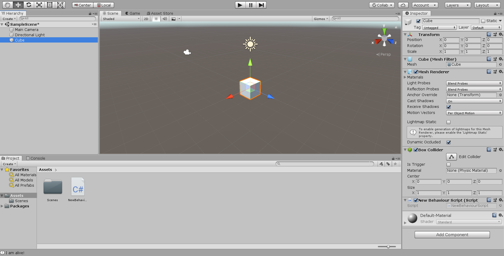
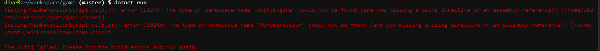
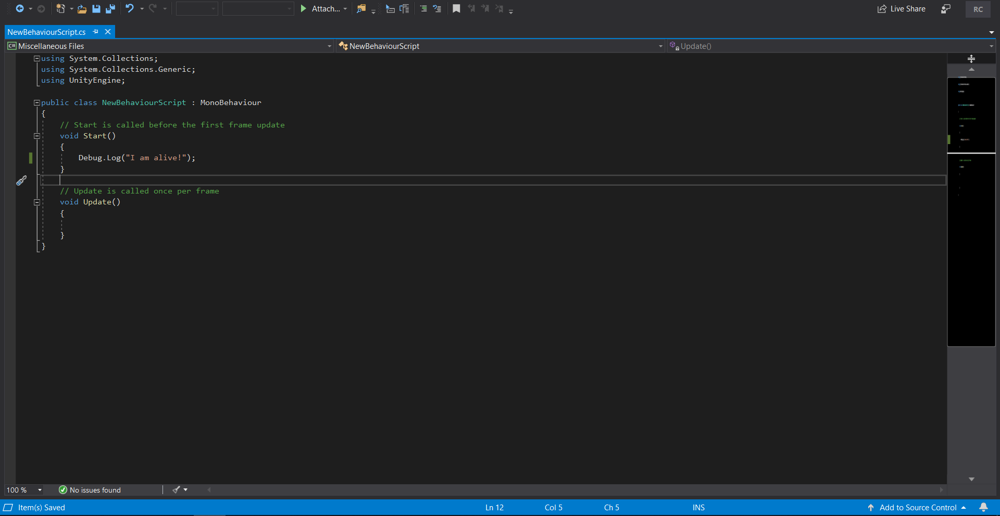
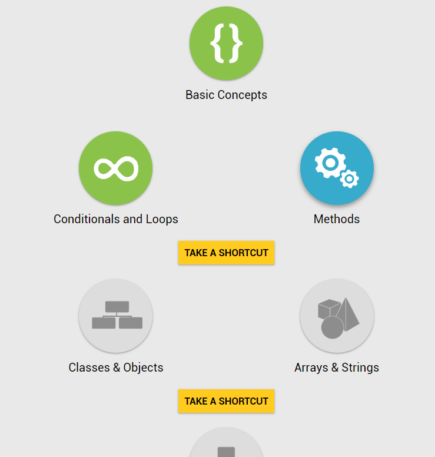
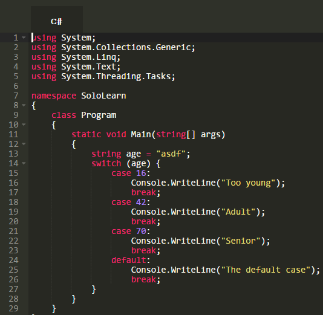

# Entry 1: Introduction

I know I want to create a 3D game for my independent study, so I decided to learn C# and Unity. For the first week of my study, I try to have a deeper understanding of what is C# and Unity and what they can do. All I know before doing any research is that C# is a language that can allow me to create games on Unity since Unity uses it. To create a game using Unity, there's no need to use any code. However, I want to code a game and not just use the controls that Unity supplies. C# is the language that allows me to code in Unity.

## What is Unity

Unity is a game engine that gives users the ability to create games and interactive experiences in 2D and 3D. The creations can be used on many platforms.

## What is C#

C# is an object-oriented language that is used to create applications that run on the .NET framework. The .NET framework includes the common language runtime (CLR) and a unified set of class libraries. The languages and libraries will be able to work together seamlessly.

## Getting started

* I have to download Unity on my own computer since Unity runs locally. Then, I explore how to create an object and see what I'm provided with in Unity.

**Unity**<br>


* In addition to downloading Unity, I need to figure out how I'm going to use C# to control the object in the scene. At first, I was thinking of writing my C# code in Cloud 9. I downloaded The .NET core in Cloud 9, but I wasn't able to use the Unity libraries. I decided to use Visual Studio to test out C#. I also push my code to GitHub in case anything went wrong.

**Unable to use C9**<br>


**Visual Studio**<br>


## Learning C#

I use SoloLearn to understand the syntax of C#.<br>


### Variables

Indicating data type before the variable name

* int - integer
* float - floating point number
* double - double-precision version of float
* char - a single character/letter
* bool - Boolean(True or False)
* string - a sequence of characters
* var - find the data type from the value

### Methods

* The "Main" method is the start of every C# applications
```
static void Main(string[] args){
    codes;
}
```
* Having a data type will allow the method to return a value
* "void" data type is used when the method is valueless state

### Condtions

#### if, else if, else
```
if(condition) {
    codes;
}
else if(condition) {
    codes;
}
else {
    codes;
}
```

#### Switch
Switch is used to test a variable for equality against a list of values
```
//variable have to be an integer
switch (variable) {
    case 1:
        codes;
        break;
    case 2:
        codes;
        break;
    default: //run when the variable doesn't match the case
        codes;
        break;
}
```
**Thinker with switch**<br>

### Loops

#### for loop
```
for( init; condition; increment ) {
    codes;
}
```

#### while loop
```
while(condition) {
    codes;
    //loop breaks when the condition is false, like increasing the value of the variable
}
```

#### do-while loop
The do-while loop is guaranteed to run at least one time.

```
do {
    codes;
    //increasing the value of the variable to make the while loop's condition false
} while(condition);
```

## Takeaways
* **Understanding the basics.** I learned that it is important to understand the basics of C# since Unity provided me with a scripting template and the code in there are confusing. By knowing what the code is about, I can start creating different actions for the objects in the scene.

* **Tinker allows for more understanding.** Even though SoloLearn is able to teach me some syntaxes, there are some codes that they did not explain really well. Luckily, SoloLearn has a function where I can try out the code and mess around with it to understand the code better.

[Next](entry-2.md) <br><br>
[Table of Contents](../README.md)