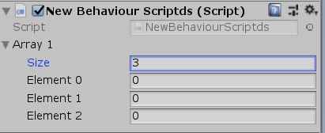

# Entry 2: Getting Started With Unity

## Unity Scripting Reference

[Reference](https://docs.unity3d.com/ScriptReference/)

This contains the scripting API that Unity provides. There's information on the classes, methods, properties and relevant information pertaining to them.

## Starter Code
```
//Namespaces
using UnityEngine;
using System.Collection;

public class (FileName) : MonoBehaviour{ //inherit from MonoBehaviour

  void Start () { //the code runs when the play button is pressed
  
  }
  
  void Update () { //the code runs every frame
  
  }
}
```

## Code
### Array
* The element of the array has to be the same data type.
* Access array on unity by making the array public and changing the values directly in Unity
```
type[] arrayName = {}; //one dimension

type[,] arrayName = { {}, {} }; //two dimensional/multidimensional

type[][] arrayName = new tyepe[][]; // jagged array - an array's element is an array
```

Array in Unity <br>


### SortedList
SortedList stores key-value pairs
```
//add key-value pair
SortedList sortedListname = new SortedList()
{
  {3, "Three"},
  {4, "Four"},
  {1, "One"},
  {5, "Five"},
  {2, "Two"}
};

Console.WriteLine("key: {0}, value: {1}", sortedList.GetKey(0), sortedList.GetByIndex(0)); //display the first key-value pair
```

### enum
The keyword `enum` is used to declare an enumeration which contains enumerator list. A list of named integer constants would be declared.

## Moving An Object
### Transform.Translate
```
public void Translate(Vector3 translation, Space relativeTo = Space.Self); //move in the local axis (x, y, and z)
```

### Vector3
Use to pass 3D positions and directions
```
Vector3.back //move back (Vector3(0,0,-1)

Vector3.down //move down (Vector3(0,-1,0)

Vector3.forward //move forward (Vector3(0,0,1)

Vector3.left //move left (Vector3(-1,0,0)

Vector3.right //move right (Vector3(1,0,0)

Vector3.up //move up (Vector3(0,1,0)
```

## Resolution
Represents a display resolution.
```
public static void SetResolution(int width, int height, bool fullscreen);

Screen.SetResolution( width-in-pixel, height-in-pixel, true) //set resolution in fullscreen
```

## Mouse
Uisng the mouse to look around in the game
```
public Vector2 mousePosition; //position of the mouse
```

## Takeaways
* **Have an idea of what to make.** By knowing what to make, I was able to have an idea of what I should learn. For example, I'm making a game and I need to know how to control my character. I would have to search up the syntax for controlling in Unity. Time was saved when having an end idea.
* **Use Google.** The quickest way to learn something is by googling what you want to learn. There are many resources out there that gives you information on how to use something. For me, I need to know how to use scripting in Unity and there are many concepts to learn for C#. However, I was learning about creating command apps, not Unity. I was able to find references to Unity scripting and have a deeper understanding of how I can create my game through it.

[Back](entry-1.md) | [Next](entry-2.md) <br><br>
[Table of Contents](../README.md)
